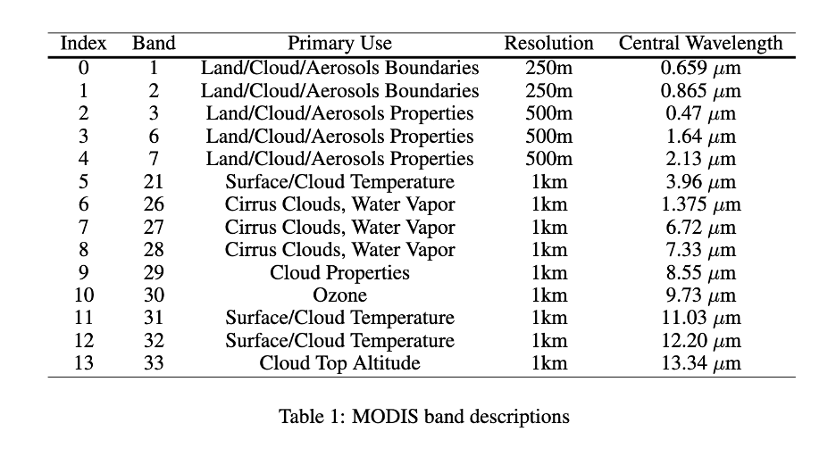

# pytorch-caney

Python package for lots of Pytorch tools.

[](https://zenodo.org/badge/latestdoi/472450059)


[](https://github.com/psf/black)
[](https://coveralls.io/github/nasa-nccs-hpda/pytorch-caney?branch=main)

## Documentation

- Latest: https://nasa-nccs-hpda.github.io/pytorch-caney/latest

# pytorch-caney

Python package for a variety of PyTorch tools for geospatial science problems.

[](https://zenodo.org/badge/latestdoi/472450059)

## Objectives
- Library to process remote sensing imagery using GPU and CPU parallelization.
- Machine Learning and Deep Learning image classification and regression.
- Agnostic array and vector-like data structures.
- User interface environments via Notebooks for easy-to-use AI/ML projects.
- Example notebooks for a quick AI/ML start with your own data.

## Installation

The following library is intended to be used to accelerate the development of data science products for remote sensing satellite imagery, or other applications. `pytorch-caney` can be installed by itself, but instructions for installing the full environments are listed under the `requirements` directory so projects, examples, and notebooks can be run.

**Note:** PIP installations do not include CUDA libraries for GPU support. Make sure NVIDIA libraries are installed locally in the system if not using conda/mamba.

```bash
module load singularity # if a module needs to be loaded
singularity build --sandbox pytorch-caney-container docker://nasanccs/pytorch-caney:latest
```

## Why Caney?

"Caney" means longhouse in Taíno.

## Contributors

- **Jordan Alexis Caraballo-Vega**: [jordan.a.caraballo-vega@nasa.gov](mailto:jordan.a.caraballo-vega@nasa.gov)
- **Jian Li**: [jian.li@nasa.gov](mailto:jian.li@nasa.gov)
- **Caleb Spradlin**: [cspradlindev@gmail.com](mailto:cspradlindev@gmail.com)

## Contributing

Please see our [guide for contributing to pytorch-caney](CONTRIBUTING.md).

# <b> User Guide </b>
---

##  1. <b> SatVision-TOA </b>

|Name|Pretrain|Resolution|Channels | Parameters|
|---|---|---|---|---|
|SatVision-TOA-GIANT|MODIS-TOA-100-M|128x128|14|3B|

### Accessing the Model

Model Repository: [HuggingFace](https://huggingface.co/nasa-cisto-data-science-group/satvision-toa-giant-patch8-window8-128)

#### **Clone the Model Checkpoint**

1. Load `git-lfs`:
```bash
  module load git-lfs
```
```bash
  git lfs install
```

2. Clone the repository:
```bash
	git clone git@hf.co:nasa-cisto-data-science-group/satvision-toa-giant-patch8-window8-128
```

<b> Note: Using SSH authentication </b>

Ensure SSH keys are configured. Troubleshooting steps:
- Check SSH connection:
```bash
	ssh -T git@hf.co # If reports back as anonymous follow the next steps
```
- Add your SSH key:
```bash
	eval $(ssh-agent)
	ssh-add ~/.ssh/your-key # Path to your SSH key
```

## <b> Running SatVision-TOA Pipelines </b>

### <b> Command-Line Interface (CLI) </b>

To run tasks with **PyTorch-Caney**, use the following command:

```bash
$ python pytorch-caney/pytorch_caney/ptc_cli.py --config-path <Path to config file>
```

### <b> Common CLI Arguments </b>
| Command-line-argument | Description                                         |Required/Optional/Flag | Default  | Example                  |
| --------------------- |:----------------------------------------------------|:---------|:---------|:--------------------------------------|
| `-config-path`                  | Path to training config                                   | Required | N/A      |`--config-path pytorch-caney/configs/3dcloudtask_swinv2_satvision_gaint_test.yaml`         |
| `-h, --help`               | show this help message and exit                  | Optional | N/a      |`--help`, `-h` |


### <b> Examples </b>

**Run 3D Cloud Task with Pretrained Model**:
```shell
$ python pytorch-caney/pytorch_caney/ptc_cli.py --config-path pytorch-caney/configs/3dcloudtask_swinv2_satvision_giant_test.yaml
```
**Run 3D Cloud Task with baseline model**:
```shell
$ python pytorch-caney/pytorch_caney/ptc_cli.py --config-path pytorch-caney/configs/3dcloudtask_fcn_baseline_test.yaml
```

**Run SatVision-TOA Pretraining from Scratch**:
```shell
$ python pytorch-caney/pytorch_caney/ptc_cli.py --config-path pytorch-caney/configs/mim_pretrain_swinv2_satvision_giant_128_onecycle_100ep.yaml
```

## **3. Using Singularity for Containerized Execution**

**Shell Access**

```bash
$ singularity shell --nv -B <DRIVE-TO-MOUNT-0> <PATH-TO-CONTAINER>
Singularity> export PYTHONPATH=$PWD:$PWD/pytorch-caney
```

**Command Execution**
```bash
$ singularity exec --nv -B <DRIVE-TO-MOUNT-0>,<DRIVE-TO-MOUNT-1> --env PYTHONPATH=$PWD:$PWD/pytorch-caney <PATH-TO-CONTAINER> COMMAND
```

### **Example**

Running the 3D Cloud Task inside the container:

```bash
$ singularity shell --nv -B <DRIVE-TO-MOUNT-0> <PATH-TO-CONTAINER>
Singularity> export PYTHONPATH=$PWD:$PWD/pytorch-caney
Singularity> python pytorch-caney/pytorch_caney/ptc_cli.py --config-path pytorch-caney/configs/3dcloudtask_swinv2_satvision_giant_test.yaml
```

---

## <b> 4. ThreeDCloudTask Pipeline </b>

This document describes how to run the `ThreeDCloudTask` pipeline using the provided configuration files and PyTorch Lightning setup. This requires downloading the 3D Cloud dataset from HuggingFace.

## Pipeline Overview

The `ThreeDCloudTask` is a PyTorch Lightning module designed for regression tasks predicting a 3D cloud vertical structure. The pipeline is configurable through YAML files and leverages custom components for the encoder, decoder, loss functions, and metrics.

## Running the Pipeline

Follow the steps below to train or validate the `ThreeDCloudTask` pipeline.

### Prepare Configuration

Two example configuration files are provided:

- `3dcloudtask_swinv2_satvision_gaint_test.yaml`: Configures a pipeline using the SwinV2-based SatVision encoder.
- `3dcloudtask_fcn_baseline_test.yaml`: Configures a baseline pipeline with a fully convolutional network (FCN).

Modify the configuration file to suit your dataset and training parameters.

### Run the Training Script

Example:
```bash
$ singularity shell --nv -B <DRIVE-TO-MOUNT-0> <PATH-TO-CONTAINER>
Singularity> export PYTHONPATH=$PWD:$PWD/pytorch-caney
Singularity> python python pytorch-caney/pytorch_caney/ptc_cli.py --config-path pytorch-caney/configs/3dcloudtask_swinv2_satvision_giant_test.yaml
```

### Script Behavior

- **Pipeline Initialization**: The script initializes the pipeline using the `PIPELINES` registry, based on the `PIPELINE`value in the configuration file.
- **Model and Data Module Setup**: The script automatically detects and uses the appropriate `DATAMODULE` and `MODEL` components specified in the configuration.
- **Training Strategy**: The `get_strategy` function selects the optimal training strategy, including distributed training if applicable.
- **Checkpoints**: If a checkpoint path is provided in the configuration (`MODEL.RESUME`), training resumes from that checkpoint.
### Output

The results, logs, and model checkpoints are saved in a directory specified by:
`<output-dir>/<model-name>/<tag>/`

Example:

`./outputs/3dcloud-svtoa-finetune-giant/3dcloud_task_swinv2_g_satvision_128_scaled_bt_minmax/`

### Configuration Details

#### 3D Cloud Task Example Configurations

```yaml
PIPELINE: '3dcloud'
DATAMODULE: 'abitoa3dcloud'
MODEL:
  ENCODER: 'satvision'
  DECODER: 'fcn'
  PRETRAINED: satvision-toa-giant-patch8-window8-128/mp_rank_00_model_states.pt
  TYPE: swinv2
  NAME: 3dcloud-svtoa-finetune-giant
  IN_CHANS: 14
  DROP_PATH_RATE: 0.1
  SWINV2:
    IN_CHANS: 14
    EMBED_DIM: 512
    DEPTHS: [ 2, 2, 42, 2 ]
    NUM_HEADS: [ 16, 32, 64, 128 ]
    WINDOW_SIZE: 8
    NORM_PERIOD: 6
DATA:
  BATCH_SIZE: 32 
  DATA_PATHS: [/explore/nobackup/projects/ilab/data/satvision-toa/3dcloud.data/abiChipsNew/]
  TEST_DATA_PATHS: [/explore/nobackup/projects/ilab/data/satvision-toa/3dcloud.data/abiChipsNew/]
  IMG_SIZE: 128 
TRAIN:
  USE_CHECKPOINT: True
  EPOCHS: 50 
  WARMUP_EPOCHS: 10
  BASE_LR: 3e-4 
  MIN_LR: 2e-4
  WARMUP_LR: 1e-4
  WEIGHT_DECAY: 0.05
  LR_SCHEDULER:
    NAME: 'multistep'
    GAMMA: 0.1
    MULTISTEPS: [700,]
LOSS:
  NAME: 'bce'
PRECISION: 'bf16'
PRINT_FREQ: 10 
SAVE_FREQ: 50
VALIDATION_FREQ: 20
TAG: 3dcloud_task_swinv2_g_satvision_128_scaled_bt_minmax
```

#### FCN Baseline Configuration

```yaml
PIPELINE: '3dcloud'
DATAMODULE: 'abitoa3dcloud'
MODEL:
  ENCODER: 'fcn'
  DECODER: 'fcn'
  NAME: 3dcloud-fcn-baseline
  IN_CHANS: 14
  DROP_PATH_RATE: 0.1
DATA:
  BATCH_SIZE: 32 
  DATA_PATHS: [/explore/nobackup/projects/ilab/data/satvision-toa/3dcloud.data/abiChipsNew/]
  TEST_DATA_PATHS: [/explore/nobackup/projects/ilab/data/satvision-toa/3dcloud.data/abiChipsNew/]
  IMG_SIZE: 128 
TRAIN:
  ACCELERATOR: 'gpu'
  STRATEGY: 'auto'
  EPOCHS: 50 
  WARMUP_EPOCHS: 10
  BASE_LR: 3e-4 
  MIN_LR: 2e-4
  WARMUP_LR: 1e-4
  WEIGHT_DECAY: 0.05
  LR_SCHEDULER:
    NAME: 'multistep'
    GAMMA: 0.1
    MULTISTEPS: [700,]
LOSS:
  NAME: 'bce'
PRINT_FREQ: 10 
SAVE_FREQ: 50
VALIDATION_FREQ: 20
TAG: 3dcloud_task_fcn_baseline_128_scaled_bt_minmax
```

###  Key Components

#### Model Components

- **Encoder**: Handles feature extraction from input data.
- **Decoder**: Processes features into an intermediate representation.
- **Segmentation Head**: Produces the final output with a specific shape (91x40).

#### Loss Function

- **Binary Cross-Entropy Loss (`bce`)** is used for training.

#### Metrics

- **Jaccard Index (IoU)**: Evaluates model accuracy.
- **Mean Loss**: Tracks average loss during training and validation.

#### Optimizer

- Custom optimizer configurations are handled by `build_optimizer`.

### Additional Notes

- Customize your `DATAMODULE` and `MODEL` definitions as per the dataset and task requirements.
- To run the pipeline with GPUs, ensure your system has compatible hardware and CUDA installed.

---

## <b> Masked-Image-Modeling Pre-Training Pipeline </b>

---

For an example of how MiM pre-trained models work, see the example inference notebook in `pytorch-caney/notebooks/`

# <b> SatVision-TOA Model Input Data Generation and Pre-processing </b>

---

## Overview 

- For expected model input see "Expected Model Input" section
- For steps taken for generating the MODIS-TOA pre-training dataset see "MODIS-TOA Dataset Generation" section



## MODIS-TOA Dataset Generation

The MODIS TOA dataset is derived from MODIS MOD02 Level 1B swaths, which provide calibrated and geolocated irradiances across 36 spectral bands. The data processing pipeline involves compositing, calibration, and normalization steps to convert raw data into a format suitable for deep learning model ingestion. 

MODIS data comes in three spatial resolutions 250 m, 500 m and 1 km where bands 1 and 2 are natively 250 m, bands 3 – 7 are natively 500 m and bands 8 – 36 are natively 1 km.  For this work all bands need to be at the same spatial resolution so the finer resolution bands 1 – 7 have been aggregated to 1 km.

The initial step involves compositing MODIS 5-minute swaths into daily global composites at 1 km spatial resolution. This step consolidates continuous swath data into a consistent daily global grid. 

The SatVision TOA model is pre-trained on 14 MODIS band L1B Top-Of-Atmosphere (TOA) irradiance imageries. Bands were selected based on which ones were most similar to spectral profiles of other instruments such as GOES ABI. See Table 1 for mapping each band to one of the 14 indices and the central wavelength for each band.

## Conversion to TOA Reflectance and Brightness Temperature

After generating daily composites, digital numbers (DNs) from the MODIS bands are converted into Top-of-Atmosphere (TOA) reflectance for visible and Near-Infrared (NIR) bands, and brightness temperature (BT) for Thermal Infrared (TIR) bands. The conversion is guided by the MODIS Level 1B product user guide and implemented through the `SatPy` Python package. These transformations give the data physical units (reflectance and temperature). 

## Expected Model Input

The pre-processed data should closely match the bands listed in the table provided in the model documentation, ensuring that each input channel accurately corresponds to a specific MODIS band and spectral range. The exact bands required depend on the task; however, the general expectation is for consistency with the MODIS TOA reflectance and BT band specifications.

## Equations for MODIS DN Conversion

Radiance and reflectance scales and offsets are found in the MOD021KM metadata, specifically within each subdataset.

Radiance: `radianceScales` and `radianceOffsets`

Reflectance: `reflectanceScales` and `reflectanceOffsets`

### Reflectance Calibration
The formula for converting MODIS DN values to TOA reflectance is:

$$\text{Reflectance} = (DN - \text{reflectanceOffsets}) \times \text{reflectanceScales} \times 100$$

This formula scales and converts the values into percentage reflectance.

### Brightness Temperature Calibration

For TIR bands, the calibration to Brightness Temperature ($BT$) is more involved and relies on physical constants and the effective central wavenumber ($WN$).

The equation for converting MODIS DN to BT is:

$$\text{Radiance} = (DN - \text{radianceOffsets}) \times \text{radianceScales}$$


$$BT = \frac{c_2}{\text{WN} \times \ln\left(\frac{c_1}{\text{Radiance} \times \text{WN}^5} + 1\right)}$$


$$BT = \frac{(BT - tci)}{tcs}$$

Where: 

- $c_1$ and $c_2$ are derived constants based on the Planck constant $h$, the speed of light $c$, and the Boltzmann constant $k$.
- $tcs$ is the temperature correction slope, and $tci$ is the temperature correction intercept.

### Scaling for Machine Learning Compatibility

Both TOA reflectance and BT values are scaled to a range of 0-1 to ensure compatibility with neural networks, aiding model convergence and training stability: 

 **TOA Reflectance Scaling**

Reflectance values are scaled by a factor of 0.01, transforming the original 0-100 range to 0-1. 

$$\text{TOA Reflectance (scaled)} = \text{TOA Reflectance} \times 0.01$$

**Brightness Temperature Scaling**

Brightness temperatures are min-max scaled to a range of 0-1, based on global minimum and maximum values for each of the 8 TIR channels in the dataset.

$$\text{Scaled Value} = \frac{\text{Original Value} - \text{Min}}{\text{Max} - \text{Min}}$$

This normalization process aligns the dynamic range of both feature types, contributing to more stable model performance. 

## Example Python Code

### MODIS L1B

- https://github.com/pytroll/satpy/blob/main/satpy/readers/modis_l1b.py

Below is an example of the Python code used in SatPy for calibrating radiance, reflectance, and BT for MODIS L1B products:

```python

def calibrate_radiance(array, attributes, index):
    """Calibration for radiance channels."""
    offset = np.float32(attributes["radiance_offsets"][index])
    scale = np.float32(attributes["radiance_scales"][index])
    array = (array - offset) * scale
    return array


def calibrate_refl(array, attributes, index):
    """Calibration for reflective channels."""
    offset = np.float32(attributes["reflectance_offsets"][index])
    scale = np.float32(attributes["reflectance_scales"][index])
    # convert to reflectance and convert from 1 to %
    array = (array - offset) * scale * 100
    return array


def calibrate_bt(array, attributes, index, band_name):
    """Calibration for the emissive channels."""
    offset = np.float32(attributes["radiance_offsets"][index])
    scale = np.float32(attributes["radiance_scales"][index])

    array = (array - offset) * scale

    # Planck constant (Joule second)
    h__ = np.float32(6.6260755e-34)

    # Speed of light in vacuum (meters per second)
    c__ = np.float32(2.9979246e+8)

    # Boltzmann constant (Joules per Kelvin)
    k__ = np.float32(1.380658e-23)

    # Derived constants
    c_1 = 2 * h__ * c__ * c__
    c_2 = (h__ * c__) / k__

    # Effective central wavenumber (inverse centimeters)
    cwn = np.array([
        2.641775E+3, 2.505277E+3, 2.518028E+3, 2.465428E+3,
        2.235815E+3, 2.200346E+3, 1.477967E+3, 1.362737E+3,
        1.173190E+3, 1.027715E+3, 9.080884E+2, 8.315399E+2,
        7.483394E+2, 7.308963E+2, 7.188681E+2, 7.045367E+2],
        dtype=np.float32)

    # Temperature correction slope (no units)
    tcs = np.array([
        9.993411E-1, 9.998646E-1, 9.998584E-1, 9.998682E-1,
        9.998819E-1, 9.998845E-1, 9.994877E-1, 9.994918E-1,
        9.995495E-1, 9.997398E-1, 9.995608E-1, 9.997256E-1,
        9.999160E-1, 9.999167E-1, 9.999191E-1, 9.999281E-1],
        dtype=np.float32)

    # Temperature correction intercept (Kelvin)
    tci = np.array([
        4.770532E-1, 9.262664E-2, 9.757996E-2, 8.929242E-2,
        7.310901E-2, 7.060415E-2, 2.204921E-1, 2.046087E-1,
        1.599191E-1, 8.253401E-2, 1.302699E-1, 7.181833E-2,
        1.972608E-2, 1.913568E-2, 1.817817E-2, 1.583042E-2],
        dtype=np.float32)

    # Transfer wavenumber [cm^(-1)] to wavelength [m]
    cwn = 1. / (cwn * 100)

    # Some versions of the modis files do not contain all the bands.
    emmissive_channels = ["20", "21", "22", "23", "24", "25", "27", "28", "29",
                          "30", "31", "32", "33", "34", "35", "36"]
    global_index = emmissive_channels.index(band_name)

    cwn = cwn[global_index]
    tcs = tcs[global_index]
    tci = tci[global_index]
    array = c_2 / (cwn * np.log(c_1 / (1000000 * array * cwn ** 5) + 1))
    array = (array - tci) / tcs
    return array
```

### ABI L1B

- https://github.com/pytroll/satpy/blob/main/satpy/readers/abi_l1b.py

Below is an example of the Python code used in SatPy for calibrating radiance, reflectance, and BT for ABI L1B products:

```python
 def _rad_calibrate(self, data):
        """Calibrate any channel to radiances.

        This no-op method is just to keep the flow consistent -
        each valid cal type results in a calibration method call
        """
        res = data
        res.attrs = data.attrs
        return res

    def _raw_calibrate(self, data):
        """Calibrate any channel to raw counts.

        Useful for cases where a copy requires no calibration.
        """
        res = data
        res.attrs = data.attrs
        res.attrs["units"] = "1"
        res.attrs["long_name"] = "Raw Counts"
        res.attrs["standard_name"] = "counts"
        return res

    def _vis_calibrate(self, data):
        """Calibrate visible channels to reflectance."""
        solar_irradiance = self["esun"]
        esd = self["earth_sun_distance_anomaly_in_AU"]

        factor = np.pi * esd * esd / solar_irradiance

        res = data * np.float32(factor)
        res.attrs = data.attrs
        res.attrs["units"] = "1"
        res.attrs["long_name"] = "Bidirectional Reflectance"
        res.attrs["standard_name"] = "toa_bidirectional_reflectance"
        return res

    def _get_minimum_radiance(self, data):
        """Estimate minimum radiance from Rad DataArray."""
        attrs = data.attrs
        scale_factor = attrs["scale_factor"]
        add_offset = attrs["add_offset"]
        count_zero_rad = - add_offset / scale_factor
        count_pos = np.ceil(count_zero_rad)
        min_rad = count_pos * scale_factor + add_offset
        return min_rad

    def _ir_calibrate(self, data):
        """Calibrate IR channels to BT."""
        fk1 = float(self["planck_fk1"])
        fk2 = float(self["planck_fk2"])
        bc1 = float(self["planck_bc1"])
        bc2 = float(self["planck_bc2"])

        if self.clip_negative_radiances:
            min_rad = self._get_minimum_radiance(data)
            data = data.clip(min=data.dtype.type(min_rad))

        res = (fk2 / np.log(fk1 / data + 1) - bc1) / bc2
        res.attrs = data.attrs
        res.attrs["units"] = "K"
        res.attrs["long_name"] = "Brightness Temperature"
        res.attrs["standard_name"] = "toa_brightness_temperature"
        return res
```

### Performing scaling as a torch transform

For MODIS-TOA data:

```python
import numpy as np


# -----------------------------------------------------------------------
# MinMaxEmissiveScaleReflectance
# -----------------------------------------------------------------------
class MinMaxEmissiveScaleReflectance(object):
    """
    Performs scaling of MODIS TOA data
    - Scales reflectance percentages to reflectance units (% -> (0,1))
    - Performs per-channel minmax scaling for emissive bands (k -> (0,1))
    """

    def __init__(self):
        
        self.reflectance_indices = [0, 1, 2, 3, 4, 6]
        self.emissive_indices = [5, 7, 8, 9, 10, 11, 12, 13]

        self.emissive_mins = np.array(
            [223.1222, 178.9174, 204.3739, 204.7677,
             194.8686, 202.1759, 201.3823, 203.3537],
            dtype=np.float32)

        self.emissive_maxs = np.array(
            [352.7182, 261.2920, 282.5529, 319.0373,
             295.0209, 324.0677, 321.5254, 285.9848],
            dtype=np.float32)

    def __call__(self, img):
        
        # Reflectance % to reflectance units
        img[:, :, self.reflectance_indices] = \
            img[:, :, self.reflectance_indices] * 0.01
        
        # Brightness temp scaled to (0,1) range
        img[:, :, self.emissive_indices] = \
            (img[:, :, self.emissive_indices] - self.emissive_mins) / \
                (self.emissive_maxs - self.emissive_mins)
        
        return img


# ------------------------------------------------------------------------
# ModisToaTransform
# ------------------------------------------------------------------------
class ModisToaTransform:
    """
    torchvision transform which transforms the input imagery
    """

    def __init__(self, config):

        self.transform_img = \
            T.Compose([
                MinMaxEmissiveScaleReflectance(),
                T.ToTensor(),
                T.Resize((config.DATA.IMG_SIZE, config.DATA.IMG_SIZE)),
            ])

    def __call__(self, img):

        img = self.transform_img(img)

        return img
```

For ABI data

```python
# -----------------------------------------------------------------------
# ConvertABIToReflectanceBT
# -----------------------------------------------------------------------
class ConvertABIToReflectanceBT(object):
    """
    Performs scaling of MODIS TOA data
    - Scales reflectance percentages to reflectance units (% -> (0,1))
    - Performs per-channel minmax scaling for emissive bands (k -> (0,1))
    """

    def __init__(self):
        
        self.reflectance_indices = [0, 1, 2, 3, 4, 6]
        self.emissive_indices = [5, 7, 8, 9, 10, 11, 12, 13]

    def __call__(self, img):
        
        # Digital Numbers to TOA reflectance units
        img[:, :, self.reflectance_indices] = \
            vis_calibrate(img[:, :, self.reflectance_indices])
        
        # Digital Numbers -> Radiance -> Brightness Temp (K)
        img[:, :, self.emissive_indices] = ir_calibrate(img[:, :, self.emissive_indices])
        
        return img

# ------------------------------------------------------------------------
# MinMaxEmissiveScaleReflectance
# ------------------------------------------------------------------------
class MinMaxEmissiveScaleReflectance(object):
    """
    Performs scaling of MODIS TOA data
    - Scales reflectance percentages to reflectance units (% -> (0,1))
    - Performs per-channel minmax scaling for emissive bands (k -> (0,1))
    """

    def __init__(self):
        
        self.reflectance_indices = [0, 1, 2, 3, 4, 6]
        self.emissive_indices = [5, 7, 8, 9, 10, 11, 12, 13]

        self.emissive_mins = np.array(
            [117.04327, 152.00592, 157.96591, 176.15349,
             210.60493, 210.52264, 218.10147, 225.9894],
            dtype=np.float32)

        self.emissive_maxs = np.array(
            [221.07022, 224.44113, 242.3326, 307.42004,
             290.8879, 343.72617, 345.72894, 323.5239],
            dtype=np.float32)

    def __call__(self, img):
        
        # Reflectance % to reflectance units
        img[:, :, self.reflectance_indices] = \
            img[:, :, self.reflectance_indices] * 0.01
        
        # Brightness temp scaled to (0,1) range
        img[:, :, self.emissive_indices] = \
            (img[:, :, self.emissive_indices] - self.emissive_mins) / \
                (self.emissive_maxs - self.emissive_mins)
        
        return img

# ------------------------------------------------------------------------
# AbiToaTransform
# ------------------------------------------------------------------------
class AbiToaTransform:
    """
    torchvision transform which transforms the input imagery into
    addition to generating a MiM mask
    """

    def __init__(self, img_size):

        self.transform_img = \
            T.Compose([
                ConvertABIToReflectanceBT(),
                MinMaxEmissiveScaleReflectance(),
                T.ToTensor(),
                T.Resize((img_size, img_size)),
            ])

    def __call__(self, img):

        img = self.transform_img(img)

        return img

```
