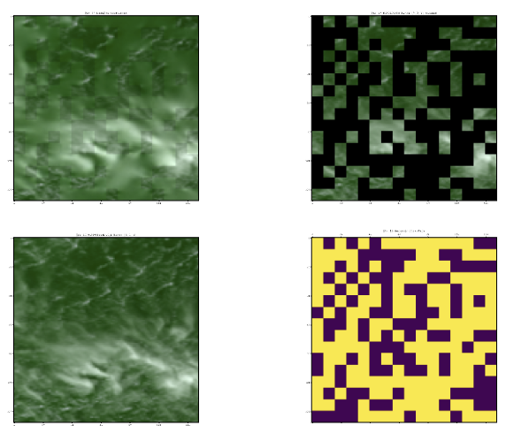

# USER GUIDE - Pipeline 1.  Image Reconstruction

**_NOTE: The Getting Started section must be completed [first.](requirements/README.md)_**

See Section _4.1 Image Reconstruction_ (https://arxiv.org/pdf/2411.17000) for reconstruction performance measurements.

## Input
The runtime script, which generates model predictions and calculates the associated reconstruction losses, specifies the following default values for input data file locations.  Modify ```tests/image_reconstruction.py``` directly to change these paths. 

### Key Configuration Parameters 
| Command-line-argument | Description                       | Default  |
| --------------------- |:----------------------------------|:---------|
| `MODEL_PATH`          | Path to training model checkpoint | ../satvision-toa-giant-patch8-window8-128/mp_rank_00_model_states.pt  |
| `CONFIG_PATH`         | Path to training model settings   | ../satvision-toa-giant-patch8-window8-128/mim_pretrain_swinv2_satvision_giant_128_window08_50ep.yaml  |
| `DATA_PATH`           | Path to validation file           | ../modis_toa_cloud_reconstruction_validation/sv_toa_128_chip_validation_04_24.npy  |
| `OUTPUT_PATH`         | Path to image result file (pdf)   | ./image-reconstruction-example.pdf  |

Annotated commands here, actual session with expected results follows:
| Description                       | Syntax  |
| ----------------------------------|:---------|
| Navigate to root | cd /explore/nobackup/projects/ilab/projects/Satvision  |
| Run script  | singularity exec --nv -B /explore/nobackup/projects/ilab/projects /explore/nobackup/projects/ilab/containers/pytorch-caney-container python tests/image_reconstruction.py  |


### _Sample Session - Image Reconstruction_ 

```bash
$ cd /explore/nobackup/projects/ilab/projects/Satvision  
$ module load singularity
$ export PYTHONPATH=$PWD:$PWD/pytorch-caney
$ singularity exec --nv -B /explore/nobackup/projects/ilab/projects /explore/nobackup/projects/ilab/containers/pytorch-caney-container python tests/image_reconstruction.py 
WARNING: underlay of /etc/localtime required more than 50 (117) bind mounts
WARNING: underlay of /usr/bin/nvidia-smi required more than 50 (616) bind mounts
13:4: not a valid test operator: (
13:4: not a valid test operator: 570.86.15
There was a problem when trying to write in your cache folder (/home/gtamkin/.cache/huggingface/hub). You should set the environment variable TRANSFORMERS_CACHE to a writable directory.
=> merge config from ../satvision-toa-giant-patch8-window8-128/mim_pretrain_swinv2_satvision_giant_128_window08_50ep.yaml
Building un-initialized model
Successfully built uninitialized model
Attempting to load checkpoint from ../satvision-toa-giant-patch8-window8-128/mp_rank_00_model_states.pt
Successfully applied checkpoint
Calling model.encoder() for 128 samples to run prediction and calculate reconstruction losses
100%|██████████████████████████████████████████████████████████████████████████████████████████████████████████████████████████████████████████████████████████████████████| 128/128 [00:17<00:00,  7.27it/s]
Successfully exported reconstruction results to: ./image-reconstruction-example.pdf
```



## Output

PDF file with images comparing ....
