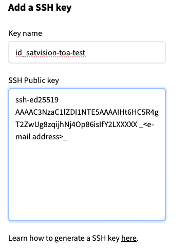

# Getting Started
You'll need to perform all of the steps below to run SatVision-TOA.

## Requirements

* Container platform _or_ virtual environment (e.g., anaconda). 
* GPU support.
* HuggingFace account
* SatVision-TOA datasets

_CPU support is limited and the author does not provide any guarantee of usability._

## Provided

* Docker container, which can also be converted to a Singularity container.
* Virtual environment specification [file](environment_gpu.yml) 

CPU support is limited and the author does not provide any guarantee of usability.

## Architecture

The container is built on top of NGC NVIDIA PYTORCH containers.

This application is powered by PyTorch and PyTorch Lighning AI/ML backends.

## Installation

SatVision-TOA can be installed in at least two ways: 1) Singularity container or 2) Anaconda environment.

### 1) Singularity Container Installation

```bash
module load singularity
singularity build --sandbox pytorch-caney docker://nasanccs/pytorch-caney:latest
```

#### Container Usage

As an example, you can shell into the container:

```bash
singularity shell --nv -B <mounts> /path/to/container/pytorch-caney
Singularity> python <SatVision-TOA API>
```

### 2) Anaconda Environment Installation

``` bash
git clone git@github.com:nasa-nccs-hpda/pytorch-caney.git
cd pytorch-caney; conda env create -f requirements/environment_gpu.yml;
```

#### Environment Usage

```bash
conda activate pytorch-caney
python <SatVision-TOA API>
```

##### SatVision-TOA Application Programming Interface (API) 

The API for SatVision-TOA, which is a Python application that is invoked from the command line, is described in the [User Guide](../USER_GUIDE.md).

_Note that the only runtime difference based on installation is that the command line is prefixed by **Singularity>** when invoked from within the container._

## Setup Hugging Face (HF) Account Access

Setup a HuggingFace account in order to retrieve the model and supporting datasets.  Required steps:
1. Create HF account.
2. Create a local SSH key.
3. Register the SSH key with HF.

### 1) Create HF account
Visit the [website](https://huggingface.co/join) to create HF account by specifying the "_<e-mail address>_" to link to account.

### 2) Create a local SSH key 
Perform the shortcut steps in the sample session below to create an SSH key and add it to HF.  Background details are provided [here] https://huggingface.co/docs/hub/en/security-git-ssh#add-a-ssh-key-to-your-account

### _Sample Session - Create SSH key and add to Hugging Face_ 

```bash
<user>@discover14:/lscratch/tdirs/gt-scratch/satvision-toa-test$ ssh-keygen -t ed25519 -C "_<e-mail address>_"
Generating public/private ed25519 key pair.
Enter file in which to save the key (/home/<user>/.ssh/id_ed25519): /home/<user>/.ssh/id_satvision-toa-test
Enter passphrase (empty for no passphrase): 
Enter same passphrase again: 

Your identification has been saved in /home/<user>/.ssh/id_satvision-toa-test.
Your public key has been saved in /home/<user>.ssh/id_satvision-toa-test.pub.
The key fingerprint is:
SHA256:2ztflrt/OxUFW4UKlOBQQzrnpoVPTLbEo3wZJ/XXXXXX _<e-mail address>_ 
The key's randomart image is:
+--[ED25519 256]--+
|      .o=o..  .o+|
|       = .o   .o.|
|      o @ .. .. .|
|     . & B  .  . |
|      E S       .|
|       O +     ..|
+----[SHA256]-----+

<user>@discover14:/lscratch/tdirs/gt-scratch/satvision-toa-test$ ls -alt ~/.ssh/id_satvision-*
-rw------- 1 <user> ilab 105 Mar  2 08:20 /home/<user>/.ssh/id_satvision-toa-test.pub
-rw------- 1 <user> ilab 419 Mar  2 08:20 /home/<user>/.ssh/id_satvision-toa-test

gtamkin@discover14:/lscratch/tdirs/gt-scratch/satvision-toa-test$ more /home/gtamkin/.ssh/id_satvision-toa-test.pub
ssh-ed25519 AAAAC3NzaC1lZDI1NTE5AAAAIHt6HC5R4gT2ZwUg8zqijhNj4Op86isIfY2LXXXXX _<e-mail address>_
```

### 3) Register the SSH key with HF 



```


- We are missing a file from the HF repo:  